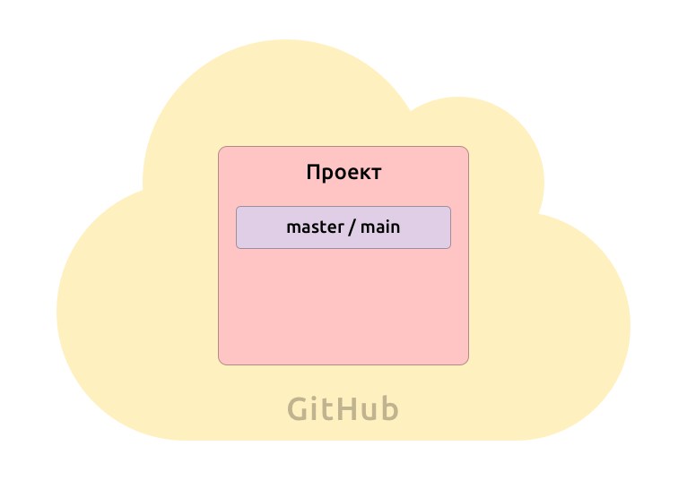
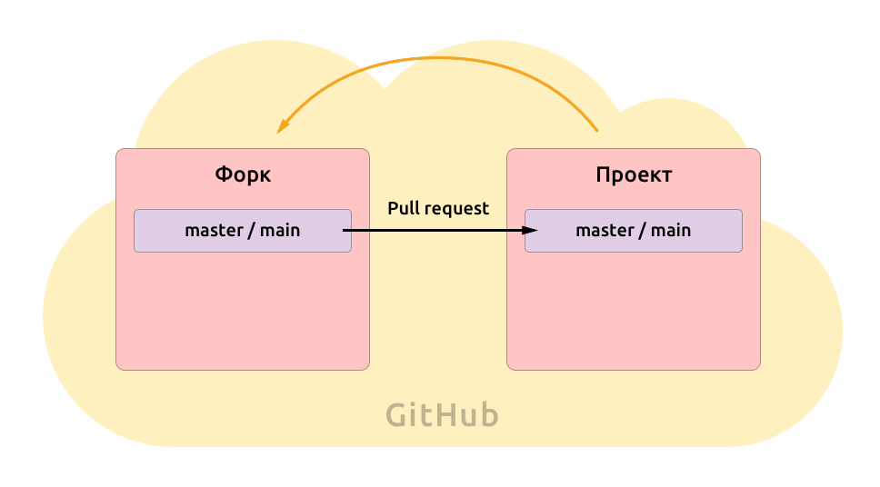
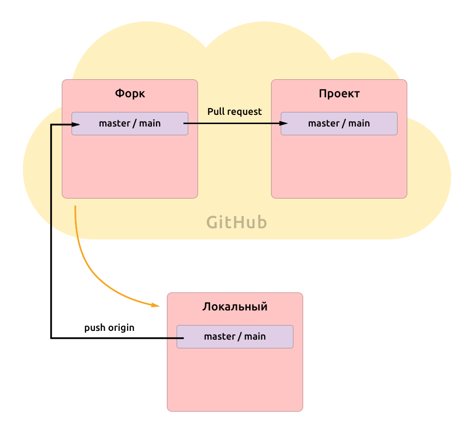
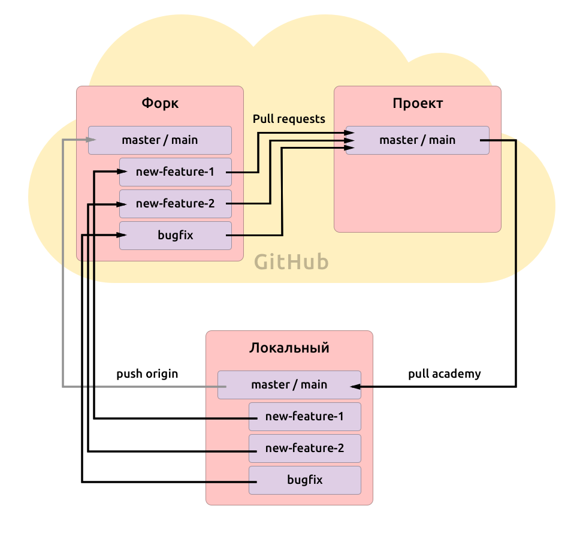

> Сразу обозначу, что существует рабочий процесс “gitflow” (или “git workflow”) . Там есть свой специфический подход к ветвлению и свои законы (еще более сложные). Речь не о нем, а о процессе, заведенном в HTML Academy.

## Проблема

Итак, начав работу с гитом в Академии, вы получили следующие инструкции:

1. форкнуть мастер-репозиторий Академии с проектом;
2. склонировать себе на компьютер;
3. создать новую ветку;
4. отправить ее в свой форк;
5. оттуда сделать пул-реквест в мастер-репозиторий;
6. когда его примут — получить из мастер-репозитория обновления в свой локальный репозиторий (ну и в форк еще желательно отправить).

Если вы еще не потеряли нить, то могут появиться некоторые вопросы. А именно:

- Зачем я создаю ветку в своем же собственном локальном репозитории?
- Зачем я получаю свои же правки через репозиторий Академии (и это главное)?

Давайте разбираться =)

## От условности к реальности

Представим, что проект не учебный, а реальный. Так мы сможем приводить обоснования для решений из реального мира.  
Пускай это будет статический сайт, без бэкенда (для примера хватит).  
Соберем простенькую команду (состав примерный).

### Наша команда
- **Тимлид** — наши старший коллега с опытом работы и повышенным чувством ответственности. Он хорошо знает верстку и JavaScript.  
    *Его роль играет наставник*
- **Дизайнер** — автор дизайна и макета сайта.  
    *Его роль частично играет безмолвный кексобот и Николай =)*
- **Верстальщик** — тот, кто сделает верстку макета.  
    *Это вы*
- **Девопс** — специальный человек, который настроит тесты и публикацию проекта.  
    *Он настроил тесты, а публикация проекта останется в воображении (кексобот умеет публиковать только версию разработки)*

### Наши задачи
1. **Сайт должен автоматически публиковаться при обновлении мастер-репозитория**  
    Загружать файлы вручную уже не модно. Гораздо удобнее и надежнее сделать этот процесс автоматическим: так наш сайт всегда будет синхронизирован с рабочим репозиторием.
2. **Над сайтом могут работать несколько специалистов одновременно**  
    У нас есть команда, и хотя каждый занимается своим делом, в какой-то момент мы можем работать с одним и тем же файлом. Это не должно привести к тому, что коллеги будут ломать работу друг друга.
3. **Код должен автоматически проверяться на ошибки**  
    Работая в команде, мы должны соблюдать правила работы с кодом, иначе он очень быстро превратится в вонючую кучу мусора. Мы условились как именно будем его оформлять и настроим проверки при добавлении кода, чтобы код соответствовал правилам.

И все эти задачи нам помогут решить Git и GitHub.

## Каждому — по репозиторию! Или по два?

Итак, наши коллеги уже решили одну из задач (да, вот так сразу).  
Они создали под проект репозиторий на GitHub, откуда и настроили публикацию сайта. Теперь при любых обновлениях, сайт собирается и отправляется на сервер прямо из GitHub.

Репозиторий очень прост: в нем лежит ветка **master** (это основная ветка, и она есть всегда, а с некоторых пор название по умолчанию будет **main**). Там лежит рабочий код, готовый к публикации. Это будет рабочая, *продакшн-версия* нашего проекта и наш мастер-репозиторий:

А еще, так как эта версия сразу же публикуется, доступ к ее правке имеет только тимлид, чтобы никакой новичок не смог что-нибудь испортить. Так будет безопасно и надежно, что очень хорошо...

Стоп, что? Но мы и есть этот новичок, так как же нам работать с проектом?

### Так как нам работать?

Собственно, эту задачу и решает одна из самых классных функций GitHub. Возможность **форкнуть** проект. **Форк** нажатием одной кнопки создает копию репозитория в нашем аккаунте, где у нас уже есть все права:

А еще GitHub привязывает наш форк к основному репозиторию и позволяет очень легко создавать запросы на изменения из форка в основной репозиторий. Это называется **pull request**.

То есть, мы меняем код в форке и отправляем его в репозиторий, где наш тимлид сможет проверить обновление на ошибки и принять его, либо написать ревью с указанием того, что нужно поправить.

А еще при создании pull request можно настроить автоматическую проверку кода. И это решит нашу задачу №3.

Отлично, с правами разобрались! Но подождите. Ведь наш форк лежит на сервере GitHub. GitHub конечно позволяет править код прямо там, но это не очень удобно, ведь нам хочется писать код в своем любимом редакторе и проверять его работу в браузере. Как быть?

Все очень просто: нужно получить этот репозиторий себе на компьютер. То есть, получить локальную версию. Для этого мы клонируем свой репозиторий (который форк), чем создаем еще одну его копию.

Наш локальный репозиторий автоматически получает ссылку на репозиторий на GitHub, который по умолчанию называется **origin**. Через эту ссылку мы сможем отправлять обновления в форк, а оттуда создавать pull request и вносить изменения в проект.

Но кроме нас с проектом работают и другие члены команды. Что, если они внесли какие-то правки в проект? Значит, нам нужно периодически обновлять наш репозиторий прямо из проекта, а не только из своего форка. Для этого мы добавим вторую ссылку уже на мастер-репозиторий, через которую сможем обновляться (в учебном проекте это будет **academy**).

Теперь и задача №2 полностью решена. Итак, мы создали идеальную схему для работы! Или нет?

## От реальности не убежишь

Проблема в том, что реальный проект не идет как по маслу с задачами, поступающими по очереди:

1. Допустим, тимлид дал задание подготовить какую-то новую большую фичу. Вы оценили, что на нее уйдет неделя и начали работу.
2. А затем через несколько дней пришел менеджер и попросил другую фичу, которая, как вдруг оказалось, для бизнеса куда важнее.  
  Приоритет задач меняется и нужно начать работать над задачей от менеджера.
3. И вот, пока вы сидите и думаете, как это вам начать работу над другой задачей, когда текущий код уже частично переписан, вдруг подбегает дизайнер, который нашел в верстке баг, портящий весь дизайн, и слезно просит скорее это поправить (что легко можно сделать за час).

И тут у вас взрывается голова. Потому что вы не подумали заранее как работать над несколькими задачами одновременно.

### Ветки

Собственно, для этой цели и придуманы ветки.  
Ветка — это такая “версия состояния” репозитория. Их может быть много и между ними можно переключаться.

Как же с ветками решится наша проблема?

1. Когда нам принесли фичу на разработку, мы создали под нее отдельную ветку new-feature, отделив ее от основной (это master или main — по сути, тоже ветка) и начали работать в new-feature;
2. когда пришел менеджер, мы снова перешли в основную ветку и создали из нее другую: new-feature-2, которая существует параллельно с new-feature и не содержит ее изменений;
3. а когда пришел дизайнер, мы снова от основной ветки создали новую типа bugfix, быстренько там все поправили и отправили pull request в основной репозиторий, после чего спокойно продолжили работу в new-feature-2.

При этом, pull request мы создаем прямо из этих веток, но запрашиваем изменения в мастер основного проекта, так как хотим их внедрить в продакшн-версию.

И еще есть важное условие. Мы никогда не должны писать код прямо в ветке master. Иначе с поступлением новой задачи мы не сможем создать оттуда новую, ничем не затронутую ветку.

Поэтому и получается такой странный путь у наших изменений: мы пишем код в новой ветке, отправляем его из форка в мастер-репозиторий, а затем получаем его оттуда в наш локальный мастер.

----------

Теперь то у нас точно все идеально? Конечно, нет =)

Каким-то проектам этого подхода будет недостаточно и им нужны релизы, а для какого-нибудь личного проекта с одним разработчиком это явный перегиб.

Никаких идеальных решений в вэб-разработке не существует.  
Но это уже совсем другая история.

