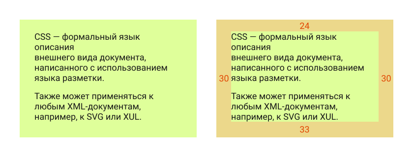
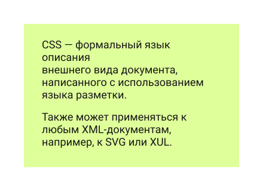
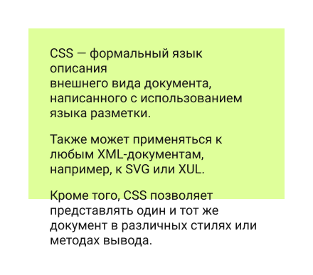
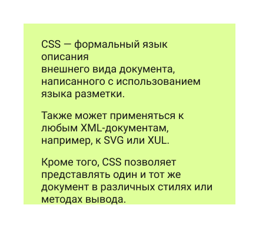
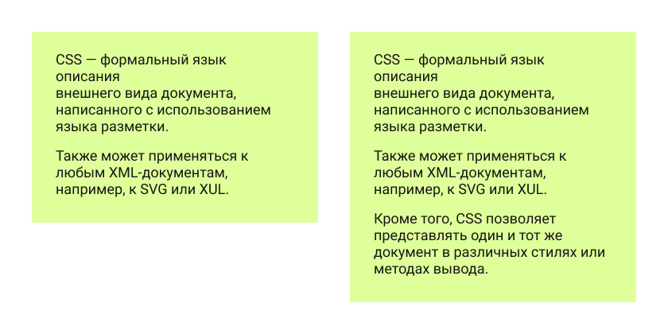
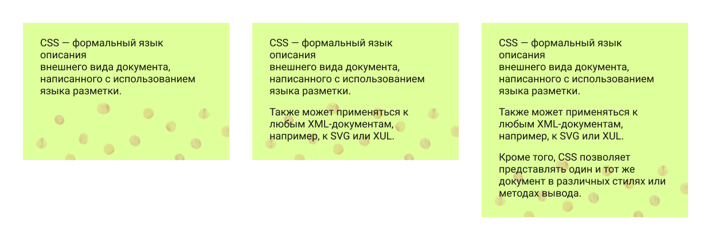
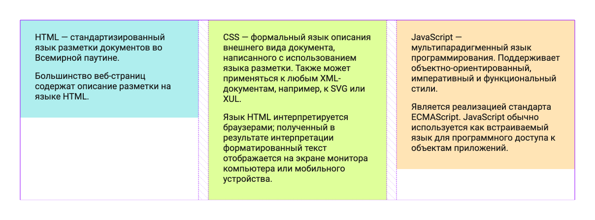

Очень многие при работе со своими первыми макетами используют для задания размеров элементов высоту.
Кажется, это один из простейших способов сверстать элемент и попасть в макет.

Давайте сверстаем простейший блок, который выглядит вот так (блок и блок с размерами отступов):



Это обычный блок, содержащий в себе 2 параграфа текста. И если все сделать так, как учат в академии, то у нас получится вот такой HTML-код:

```html
<div class="box">
    <p>CSS — формальный язык описания внешнего вида документа, написанного с использованием языка разметки.</p>
    <p>Также может применяться к любым XML-документам, например, к SVG или XUL.</p>
</div>
```

И такой вот CSS (я не ставлю подключение шрифта и прочие параметры):

```css
.box {
    width: 360px;
    height: 220px;
    padding-top: 24px;
    padding-right: 30px;
    padding-left: 30px;
    background-color: #dfff9a;
}
```

И результат будет именно таким, какой нам нужен:



Вот и всё! Или…

Ладно, ладно, я действительно слукавил, но честное слово: это нужно было для наглядности. В свое оправдание же могу сказать, что эта ошибка встречается очень часто у начинающих верстальщиков.

Конечно, в академии учат тому, что использовать здесь height неправильно, ведь сайт — штука динамичная и контент блока может поменяться. Допустим, кто-то дописал еще один параграф. Вот что будет, если у нас прописана высота:



Это называется “тест на переполнение контентом”. Из-за жестко прописанной высоты текст вывалился из блока, что выглядит не очень.

Проблема решится, если заменить height на min-height. То есть, мы укажем минимальную высоту, и текст растянет блок. И это уже будет более валидное решение:

```css
.box {
    width: 360px;
    min-height: 220px;
    padding-top: 24px;
    padding-right: 30px;
    padding-left: 30px;
    background-color: #dfff9a;
}
```

Итак, наша проблема решена.  
Но насколько качественно? Давайте посмотрим, как теперь будет выглядеть элемент при тестировании на переполнение:



Он стал выше и растянулся вместе с контентом, однако текст “прилип” к нижней части. Это выглядит не слишком красиво, да и макет явно создан с отступом снизу.

Мы можем задать этому элементу отступ снизу. Однако, если мы зададим правильный отступ, то зачем нам высота? С изначальным текстом элемент и так будет выглядеть как в макете.

Поэтому, вместо того, чтобы задавать высоту (так или иначе) можно подогнать размер с помощью отступов и получить гораздо более гибкий элемент:

```css
.box {
    width: 360px;
    padding-top: 24px;
    padding-right: 30px;
    padding-bottom: 33px;
    padding-left: 30px;
    background-color: #dfff9a;
}
```



## А когда действительно нужна минимальная высота?

Не так уж часто. Она нужна, когда наш элемент не может быть меньше какой-то высоты, но может быть больше (то есть ровно по прямому назначению).

Например, у нас есть какой-то фон, который не влияет на размер контента, но мы обязательно должны его показать:



Пример странноват, если найду лучше — заменю =)

## А с шириной не так?

На самом деле, здесь мы только приоткрываем окошко в тему чтения макета.

С шириной все не настолько критично, однако, следует по возможности избегать указания ширины тоже. Например, если у нас в дизайне стоит 3 таких блока в ряд, то можно это сделать с помощью гридов, и ширина каждого из блоков будет определена гридом. Тогда в самих блоках ширину указывать не стоит, чтобы были не просто прямоугольниками конкретного размера, а встраивались в сетку и следовали ее размерам, если она меняется (что очень полезно при адаптиве или просто обновлениях дизайна уже готового сайта):

```css
.boxes {
    display: grid;
    grid-template-columns: 1fr 1fr 1fr;
    gap: 20px;
    align-items: start;
    width: 1120px;
    margin: 0 auto;
}

.box {
    padding: 24px 30px 33px;
}
```



Отказываясь от конкретных размеров, мы создадим более гибкие блоки, управлять размерами которых можно через родительский элемент, настраивая сетку или флекс.

Это поможет не только создать более устойчивую к переполнению верстку, но и подготовиться к адаптиву (а к нему, поверьте, стоит готовиться).
