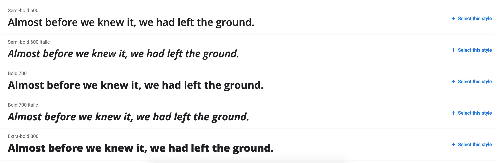

## Какие способы вообще есть?

Если говорить в очень общем смысле, то способов подключить сами шрифты к странице — это локально и внешне через какой-то сервис вроде Google Fonts.

Подключать шрифты через сервис довольно просто, достаточно разобраться в интерфейсе Google Fonts. Поэтому, этот способ мы рассматривать не будем, а разберем вариант с подключением шрифтов локально.

Если же вы в поисках легкого пути, то вам тут делать особо нечего =)  
*(Но можно прочитать последнюю часть, там про указание шрифта)*

## Из чего состоят шрифты
Зайдем издалека и рассмотрим структуру шрифта. Нам понадобятся эти знания, чтобы понимать, как мы управляемся со шрифтом.  
*Я попрошу людей, знакомых с типографией, несколько расслабиться: мы рассмотрим все в контексте веба и не будем слишком сильно усложнять.*

Прежде всего, шрифты делятся на несколько типов. Вот самые основные (иное едва ли встретится):

- шрифты с засечками (**serif**);
- шрифты без засечек (**sans-serif**);
- моноширинные (**monospace**).

Возьмем, например, семейство **Open Sans**. Это семейство без засечек, оно попадает в категорию **sans-serif**.  
*Стоп!* Мы только что говорили про шрифты, какое еще "**семейство**"?

**Семейство** — это набор шрифтов, объединенных общей стилистикой (это еще можно назвать "гарнитура", но нам в вебе ближе термин "семейство").  
Именно семейства имеют названия: Arial, Times New Roman, Helvetica. И **Open Sans** в том числе. Давайте откроем [Open Sans на Google Fonts](https://fonts.google.com/specimen/Open+Sans#standard-styles) и посмотрим что там есть:



Итак, куча разных вариантов. По сути, каждый вариант — это и есть шрифт, входящий в семейство Open Sans.
Если его скачать, то каждый шрифт будет представлен отдельным файлом:


Можно легко заметить, что шрифты отличаются друг от друга по двум параметрам: толщине (или весу, **weight**) и начертанию (**style**).
Чуть ниже находится список глифов — букв и символов, которые есть в этом семействе (но нам это важно, только если мы захотим упороться на оптимизации):


Ну, со структурой шрифта разобрались, давайте подключать!

## Разбираем @font-face по кусочкам

Итак, чтобы подключить шрифт, нам нужно в CSS использовать правило `@font-face`:

```css
@font-face {
    /* стили будут тут */
}
```

Это правило будет подключать шрифт (именно шрифт, и теперь мы знаем что это значит). Разберемся на примере нашего Open Sans.

### Основные параметры шрифта
- `font-family` — указывает, к какому семейству относится шрифт;
- `font-weight` — указывает вес шрифта;
- `font-style` — указывает начертание шрифта.

Будьте внимательны с параметром font-family. Там должно быть указано именно семейство шрифта, то есть в нашем случае это "Open Sans".

Многие по ошибке указывают "Open Sans Bold", "Open Sans Italic" и создают тем самым семейства с одним шрифтом. И каждый раз, меняя толщину шрифта, приходится менять и семейство. Так делать не нужно, @font-face как раз позволяет нам подключать к одному семейству разные шрифты с указанным весом и начертанием, чтобы браузер по этим параметрам брал нужный файл.

Получается что-то такое:

```css
@font-face {
    font-family: "Open Sans";
    font-weight: 400;
    font-style: normal;
}

@font-face {
    font-family: "Open Sans";
    font-weight: 600;
    font-style: normal;
}
```

### Подключаем файлы

Как мы помним, каждый шрифт представлен отдельным файлом. Поэтому, для каждого `@font-face` правила нужно подключить свой файл. Но с ними не все так просто (ну а как же).

У шрифтов очень много различных форматов. К счастью, для современных браузеров на данный момент используется всего 2: woff и woff2. woff2 чуть современнее и лучше оптимизирован.

Чтобы подключить файлы, нужно воспользоваться параметром src:

```css
@font-face {
    font-family: "Open Sans";
    font-weight: 400;
    font-style: normal;
    src:
        url("../fonts/open-sans.woff2") format("woff2"),
        url("../fonts/open-sans.woff") format("woff");
}

@font-face {
    font-family: "Open Sans";
    font-weight: 600;
    font-style: normal;
    src:
        url("../fonts/open-sans-semibold.woff2") format("woff2"),
        url("../fonts/open-sans-semibold.woff") format("woff");
}
```

Важно соблюсти порядок подключения и начинать с более современного (менее поддерживаемого, но лучше оптимизированного) формата. Почему?

Браузер будет считывать список файлов по очереди и загрузит первый подходящий ему файл. Все браузеры, имеющие поддержку woff2, поддерживают и woff. Следовательно, если woff будет идти первым, то до более современного формата браузеры никогда не дойдут.

### Оптимизация загрузки

Кажется, что шрифт — файл очень небольшой, всего несколько десятков килобайт. Что, блин, там оптимизировать?

Ну, давайте начнем с того, что шрифт по степени важности намного выше, чем даже контентные картинки, потому что 99% сайтов самую важную информацию предоставляют в текстовом виде. Поэтому, задержка в отображении текста крайне критична и с большой долей вероятности посетитель обратит на это внимание. А уж если вдруг  что-то случится со стабильностью или скоростью интернета…

Возможно, вы замечали, что на некоторых сайтах при загрузке появляется совсем белая страница, а на других текст показывается сперва одним шрифтом, а затем другим.  

Как раз за это отвечает параметр `font-display`. Про нюансы его работы можно писать отдельную статью (хотя, что значит можно, вот [статья Зака Лезермана в переводе на CSS-live](https://css-live.ru/articles/ischerpyvayushhee-rukovodstvo-po-strategiyam-zagruzki-veb-shriftov.html) с кучей слов и жуткими аббревиатурами типа FOIT, FOUT и FOFT).

Я же просто укажу, что значение `auto`, действующее по умолчанию, обычно использует стратегию `block`, которая означает, что пока щрифт грузится, браузер не показывает ту самую белую страницу, что не очень здорово, так как соединение может быть плохим или вовсе оборваться, что оставит посетителя сайта без текста.

Лично я предпочитаю значение `swap`: так браузер сперва покажет текст запасным шрифтом, а как только загрузится нужный, то он заменит запасной на него. Да, это создаст небольшое дергание страницы, но зато текст будет доступен сразу:

```css
@font-face {
    font-family: "Open Sans";
    font-weight: 400;
    font-style: normal;
    font-display: swap;
    src:
        url("../fonts/open-sans.woff2") format("woff2"),
        url("../fonts/open-sans.woff") format("woff");
}
```

Помимо этого, можно ускорить загрузку шрифта, добавив в `<head>` страницы предзагрузку для тех файлов шрифтов, что точно понадобятся. Тогда браузер начнет загружать шрифт еще до того, как распарсит стили и сам поймет, какие шрифты ему нужны:

```html
<link rel="preload" href="fonts/open-sans.woff2" as="font" type="font/woff2" crossorigin>
```

Есть и еще один метод: указать в адресе шрифта имя для поиска среди локально установленных в системе пользователя шрифтов, что вообще избавит от необходимости загружать какие-либо файлы:

```css
@font-face {
    font-family: "Open Sans";
    font-weight: 400;
    font-style: normal;
    font-display: swap;
    src:
        local("Open Sans"),
        url("../fonts/open-sans.woff2") format("woff2"),
        url("../fonts/open-sans.woff") format("woff");
}
```

Однако, здесь стоит проявить осторожность, так как на компьютере пользователя может стоять какой-нибудь пиратский или устаревший шрифт, который не будет выглядеть так же, как ваш.

Ну и напоследок: можно разделить шрифт по глифам и загружать его только при необходимости использования символов из определенного диапазона.  
В рамках курса этого не только не требуют, но и не рассказывают о таких возможностях. Если же очень интересно, то рекомендую посмотреть выступление Вадима Макеева _____ ___ _____?

## Как указывать шрифт

